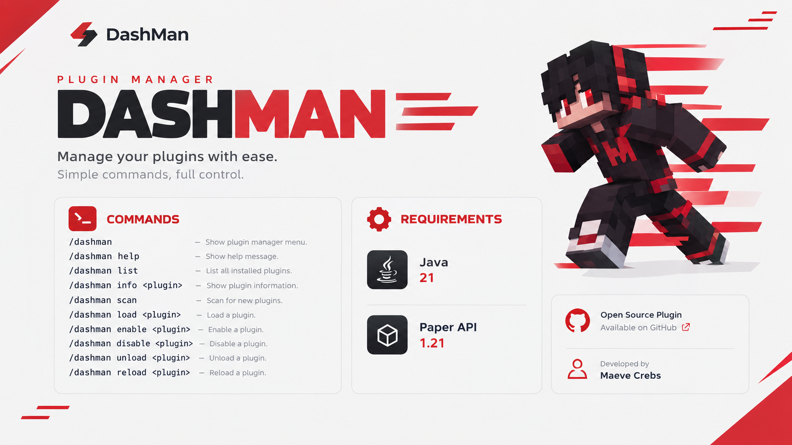

<div align="center">
  <h1>DashMan</h1>
  <h2>⚡ A Simple & Lightweight Plugin Manager</h2>
</div>

<div align="center">

</div>

<div align="center">
  


</div>

> Manage your Bukkit & Paper plugins without restarting your server.

## ✨ Features

- ⚡ Load plugins without restarting
- 🔄 Reload plugins
- ▶️ Enable & disable plugins
- 📦 Load & unload plugins
- 🔍 Inspect plugin information
- 🧩 Dependency checking
- 📋 Plugin scanning
- 📊 Plugin status overview


## 🛠️ Commands
```text
/dashman
/dashman help
/dashman list
/dashman info <plugin>
/dashman scan
/dashman load <plugin>
/dashman enable <plugin>
/dashman disable <plugin>
/dashman unload <plugin>
/dashman reload <plugin>
```
## 📋 Example
```text
DashMan Plugins
  ✔ EssentialsX    2.21.0
  ✔ LuckPerms      5.4.145
  ✔ Vault          1.7.3
  ✔ DashMan        1.0.0
  ✘ TestPlugin     1.0.0

5 Plugins • 4 Enabled • 1 Disabled
```

## 📦 Installation
```text
1. Download DashMan.jar
2. Place it into your server's plugins folder
3. Start your server4. Run /dashman
```

## ⚙️ Reqruitmens
```text
Paper API 1.21
Java 21
```

## 🔐 Permission
```text
dashman.admin
```
```text
Default: op
```

## 🚧 Status
```text
DashMan is currently in development.
Features and APIs may change before the first stable release.
```
